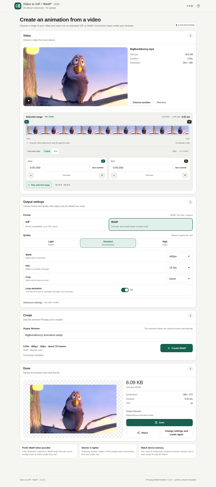

# Video to GIF / WebP

[](https://github.com/ttomohisa/htmlapps-video-to-gif-webp/actions/workflows/deploy-pages.yml)
[](LICENSE)
[](https://ttomohisa.github.io/htmlapps-video-to-gif-webp/)

[日本語版 README](README.ja.md)

A privacy-focused, single-HTML app for turning a selected range of a local video into an animated GIF or WebP without uploading the source file to a server.

## 🚀 Live demo

### [Open Video to GIF / WebP on GitHub Pages](https://ttomohisa.github.io/htmlapps-video-to-gif-webp/)

GitHub Pages delivers the initial HTML. After it loads, video trimming, decoding, cropping, resizing, frame-rate conversion, GIF/WebP encoding, preview, and export are processed locally on your device. The video you select is not uploaded by the app.


## Screenshots

### UI



The screenshots use **Big Buck Bunny** media as the sample video content. The screenshot-capture sample itself is not included in this repository.

**Big Buck Bunny attribution:** © 2008 Blender Foundation / www.bigbuckbunny.org — licensed under [Creative Commons Attribution 3.0 Unported (CC BY 3.0)](https://creativecommons.org/licenses/by/3.0/).

See [THIRD_PARTY_NOTICES.md](THIRD_PARTY_NOTICES.md) for details.

## Features

- Convert a selected video range to animated GIF or animated WebP
- Thumbnail timeline with draggable start/end points and a separate playhead
- Play only the selected range to confirm the animation before conversion
- Select **Use full video** to restore the whole known duration without changing your output settings
- Fine-tune start/end by either 0.1 second or one output frame
- Click or tap the video preview to play/pause; seeking stays in the trim timeline
- Crop to 1:1, 4:3, 16:9, or 9:16 and drag the crop area to reposition it
- Enable infinite looping or export an animation that plays once
- Width presets for 320 / 480 / 720 px / original size
- Custom integer width from 16 to 4096 px
- FPS presets for 10 / 15 / 20 / 30 fps
- Custom integer FPS from 1 to 60 fps
- Light / Standard / High quality presets
- GIF advanced settings for color count and dithering
- WebP advanced settings for quality, compression level, and lossless mode
- Editable output filename with automatic `.gif` / `.webp` extension handling
- Output preview, file size, Save, and Web Share when supported
- Japanese and English UI in the same HTML
- Mobile-first responsive layout with a fixed bottom action bar
- Embedded SVG favicon
- No runtime CDN or external JavaScript dependency
- Two compact FFmpeg WASM cores embedded in compressed form; only the selected format is inflated and loaded

## Quick start

### Use the web demo

Just [open the demo](https://ttomohisa.github.io/htmlapps-video-to-gif-webp/). No installation or account is required.

### Build a standalone HTML file

1. Download or clone this repository.
2. Double-click `build-standalone.bat` on Windows.
3. On the first build, the exact FFmpeg WASM Builder release pinned in `ffmpeg.config.json` is downloaded and verified.
4. Open the generated `dist/index.html`.
5. Copy that single file wherever you need it and open it later directly with `file://`.

The build also creates `dist/index.self-extract.html`, which stores the app HTML itself in gzip-compressed form and expands it when opened.

Python, Node.js, and a local web server are not required. The build uses Windows PowerShell and the built-in `tar.exe`.

## Usage

1. Choose or drop a video.
2. Use the thumbnail timeline to set the start (`S`) and end (`E`) of the animation, or choose **Use full video** to select the whole clip and pause at its beginning.
3. Drag the white playhead to seek, or click/tap the video preview to play and pause.
4. Use **Play selected range** to review exactly what will be converted.
5. If needed, fine-tune the start/end by one output frame or 0.1 second.
6. Choose GIF or WebP, quality, width, FPS, crop, and looping.
7. Enter the output filename and press **Create**.
8. Review the result, then save or share it.

The initial selection stays at the first five seconds (or the whole clip if shorter). **Use full video** is available only when the duration is known. Trim controls are locked while the FFmpeg core loads and conversion runs, then restored on success or failure. Long whole-video conversions still show the heavy-job confirmation.

If the browser cannot preview the source codec, FFmpeg WASM may still be able to convert it. In that case, enter the start/end times manually and try the conversion.

## GIF or WebP?

| | GIF | WebP |
| --- | --- | --- |
| Color | Up to 256 colors | Full color |
| Compatibility | Very broad | Recommended when the destination supports animated WebP |
| Typical file size | Often larger | Often smaller for a similar appearance |
| Advanced controls | Color count, dithering | Quality, compression, lossless mode |
| Looping | Infinite or play once | Infinite or play once |

The default output is WebP at 480 px, 15 fps, Standard quality. GIF is useful when compatibility matters more than color depth or file size.

## Publish with GitHub Pages

The repository includes a workflow that builds the fully embedded standalone HTML and deploys it to GitHub Pages automatically.

1. Push the repository to GitHub as `htmlapps-video-to-gif-webp`.
2. Open **Settings → Pages → Build and deployment → Source** and select **GitHub Actions**.
3. Push to `main`, or manually run **Deploy standalone app to GitHub Pages** from the Actions tab.
4. After a successful deployment, the app is available at `https://ttomohisa.github.io/htmlapps-video-to-gif-webp/`.

Each push to `main` rebuilds the standalone HTML from the pinned FFmpeg WASM assets, verifies the repository, and publishes the generated `dist` directory. If GitHub Pages has not been enabled yet, the workflow builds successfully and explains the one-time setup instead of failing at `configure-pages`.

## Development and build layout

```text
.
├─ src/index.template.html          # Application template
├─ app.config.json                  # App metadata and version
├─ ffmpeg.config.json               # Pinned FFmpeg WASM Builder release/profiles
├─ build-standalone.bat             # Windows build entry point
├─ build-standalone-local.bat       # Build against a local Builder dist
├─ build-standalone.ps1             # Standalone HTML builder
├─ components/                      # Reusable dialog / mobile bar components
├─ scripts/                         # Verification and self-extract build scripts
├─ dist/
│  ├─ index.html                    # Generated standalone app
│  └─ index.self-extract.html       # Generated self-extracting variant
└─ .github/workflows/
   ├─ build-standalone.yml          # Pull request build validation
   └─ deploy-pages.yml              # Automatic GitHub Pages deployment
```

### FFmpeg WASM profiles

This app pins v1.10.1 of [htmlapps-ffmpeg-wasm-builder](https://github.com/ttomohisa/htmlapps-ffmpeg-wasm-builder) in `ffmpeg.config.json` and embeds two purpose-built profiles:

- `video-to-gif`
- `video-to-webp`

The normal build downloads the pinned release archives plus `SHA256SUMS.txt`, verifies each archive, and embeds the gzip-compressed `ffmpeg.js` / `ffmpeg.wasm` assets into the HTML. The browser does not download FFmpeg from GitHub at runtime.

The input `File` / `Blob` is mounted through WORKERFS, so the complete source video is not copied into MEMFS before conversion. The generated animation is currently returned through MEMFS, so very large outputs are still limited by available browser/device memory.

v1.0.2 fixes the encoded GIF final-frame duration. GIF delays remain quantized to centiseconds, so some FPS values round and playback apps may treat short delays differently. The repository check executes the actual embedded WASM from both HTML variants with synthetic inputs, including loop ON/OFF and a WebP timing control. See [runtime timing and provenance](docs/RUNTIME_TIMING.md) for details and verification limits.

To develop against a locally built FFmpeg WASM Builder instead of a GitHub Release:

```bat
build-standalone-local.bat ..\htmlapps-ffmpeg-wasm-builder-main\dist
```

### Force a clean dependency download

```powershell
powershell -NoProfile -ExecutionPolicy Bypass -File .\build-standalone.ps1 -ForceDownload
```

### Repository verification

```powershell
.\scripts\check-repository.ps1
```

Repository verification requires Node.js 22+ for the dependency-free synthetic trim tests. The standalone builder itself still needs only PowerShell and `tar.exe`. These tests do not replace browser, real encoding, keyboard/touch, or runtime network-panel checks.

Default builds also update the tracked catalog file `video-to-gif-webp.html`. An explicit `-OutputPath` generates only the requested artifacts and leaves that catalog file unchanged.

The verification/build pipeline checks, among other things:

- Required repository files and reusable components
- Pinned FFmpeg WASM Builder version and required profiles
- SHA-256 integrity of downloaded Builder release archives
- No unresolved build placeholders
- No runtime external script/style/module references
- Runtime CSP contains `connect-src 'none'`
- WebAssembly execution is allowed with `wasm-unsafe-eval` without enabling general JavaScript `unsafe-eval`
- GIF and WebP runner APIs are present
- Source video is passed through WORKERFS
- Source preview does not expose native seek controls
- Both standard and self-extracting HTML variants are generated and verified
- Full-range selection, bilingual copy, conversion-range stability, cancellation, and error recovery in synthetic DOM/runner tests
- Catalog/readable/restored payload equality and embedded asset hashes

## Privacy and runtime network protection

The generated standalone HTML is designed to run without sending the selected media outside the browser session.

- Video decoding and animation encoding run locally through FFmpeg WebAssembly.
- Runtime CSP contains `connect-src 'none'`.
- FFmpeg assets are downloaded only at build time, then embedded into the generated HTML.
- Only the selected GIF or WebP core is decompressed and instantiated during a conversion.
- No analytics, telemetry, login, cloud storage, or server-side conversion is included.

The GitHub Pages version requires the initial HTML request, but the selected video content is not transmitted by the app. For fully disconnected use, open the generated `dist/index.html` locally.

## Limitations

- The app converts one continuous range at a time; it is not a general-purpose video editor.
- Animated GIF and WebP do not preserve the source video's audio.
- GIF is limited to a 256-color palette.
- Long duration, high resolution, high FPS, lossless WebP, or large GIF palettes can significantly increase processing time and memory usage.
- The source video may be convertible by FFmpeg even when the browser cannot preview its codec.
- Output is currently created in browser memory before download, so very large animations can fail on memory-constrained devices.
- The compact embedded cores require a current browser with WebAssembly, Blob Worker, and `DecompressionStream('gzip')` support.

For large 4K sources, start with a short selected range, 480 px width, and 15 fps, then increase quality only if needed.

## Dependencies

| Component | Pinned by | License | Purpose |
| --- | --- | --- | --- |
| FFmpeg 9 compact WASM (`video-to-gif`) | FFmpeg WASM Builder release in `ffmpeg.config.json` | LGPL-2.1-or-later | Decode, trim, crop, scale, palette generation, GIF encoding |
| FFmpeg 9 compact WASM (`video-to-webp`) | FFmpeg WASM Builder release in `ffmpeg.config.json` | LGPL-2.1-or-later | Decode, trim, crop, scale, animated WebP encoding |
| libwebp | Included only in the WebP Builder profile | Upstream license | Animated WebP encoder used by the WebP profile |

See [THIRD_PARTY_NOTICES.md](THIRD_PARTY_NOTICES.md) for details and the pinned Builder release for the complete corresponding notices and build information.

## Contributing

Bug reports and feature proposals are welcome through GitHub Issues. See [CONTRIBUTING.md](CONTRIBUTING.md) for development guidance.

## License

Copyright © 2026 ttomohisa

The application source in this repository is licensed under the [MIT License](LICENSE).

The generated standalone HTML also embeds FFmpeg/libwebp-derived binary assets under their respective licenses. The repository MIT License does not relicense those embedded third-party binaries; see [THIRD_PARTY_NOTICES.md](THIRD_PARTY_NOTICES.md).

Help and confirmation dialogs support short and zoomed screens: scroll inside the content, then use Close, Esc, or the backdrop to dismiss. The background page stays still while a dialog is open.
